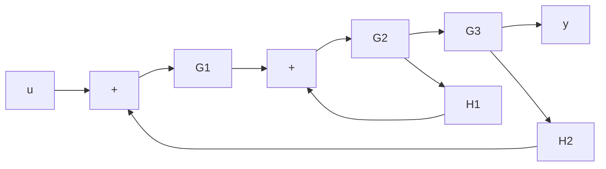
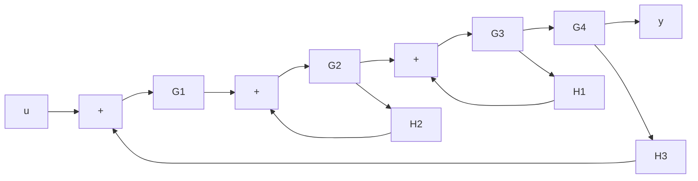
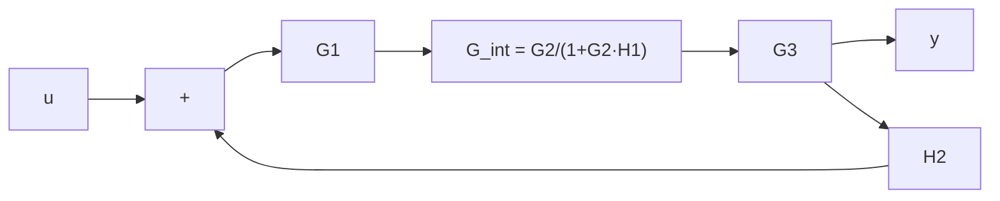
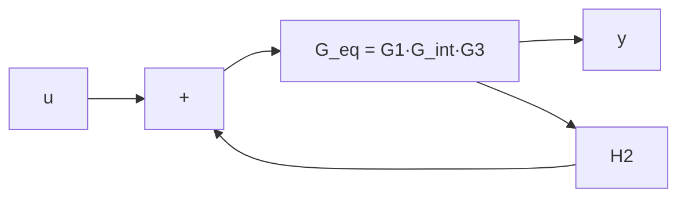
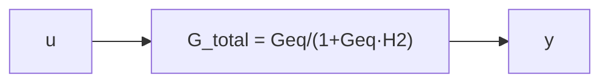

# Lazos Anidados

> [!definicion] Definición
> Dos o más [[Lazos y Estructuras|lazos]] son **anidados** cuando un lazo está completamente contenido dentro de otro. El **lazo interno** se encuentra en la trayectoria directa del **lazo externo**, y el lazo externo no puede cerrarse sin pasar por el lazo interno.

---

## Representación

### Estructura básica (un lazo anidado)

### Anidamiento de tres niveles

---

## Caracterización

> [!teoria] Propiedades
> 1. El **lazo interno** está completamente contenido en la trayectoria directa del lazo externo.
> 2. El lazo externo **no puede cerrarse** sin pasar por el lazo interno.
> 3. La reducción debe hacerse **desde adentro hacia afuera**.

---

## Reducción de Lazos Anidados

> [!teorema] Procedimiento
> 1. Identificar el lazo **más interno**
> 2. Reducir usando $G_{\text{int}} = \dfrac{G}{1 + GH}$
> 3. Reemplazar por bloque equivalente
> 4. Repetir hasta obtener un solo bloque

### Paso 1: Sistema original

### Paso 2: Reducir lazo interno (G2, H1)

### Paso 3: Sistema en serie

### Paso 4: Reducir lazo externo

### Paso 5: Resultado final

$$
G_{\text{total}} = \frac{G_1 G_2 G_3}{1 + G_2 H_1 + G_1 G_2 G_3 H_2}
$$

---

## Teorema General

> [!teorema] Reducción de $n$ lazos anidados
> $$
> G_{\text{total}} = \frac{\prod_{i=1}^{n} G_i}{1 + \sum_{k=1}^{n} \left( \prod_{j=k}^{n} G_j \right) H_k}
> $$
> donde $G_i$ son los bloques en la trayectoria directa y $H_k$ las realimentaciones, con $k=1$ para el lazo más interno.

---

## Comparación con Otras Estructuras

| Estructura | Orden de reducción | Complejidad |
|------------|-------------------|-------------|
| **Lazos Anidados** | Interno → Externo | Baja |
| [[Lazos Cruzados]] | Requiere movimiento de nodos | Media |
| [[Lazos Entrelazados]] | Requiere Mason | Alta |
| [[Lazos Independientes]] | Paralelo o serie | Muy baja |

