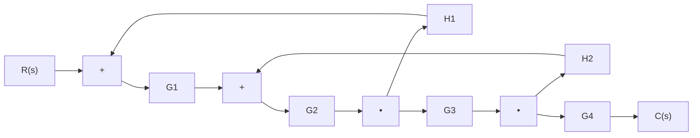
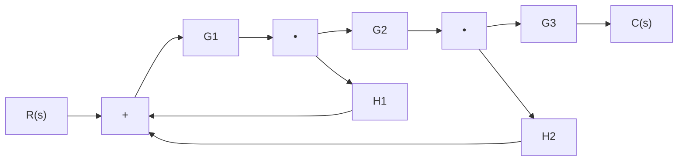
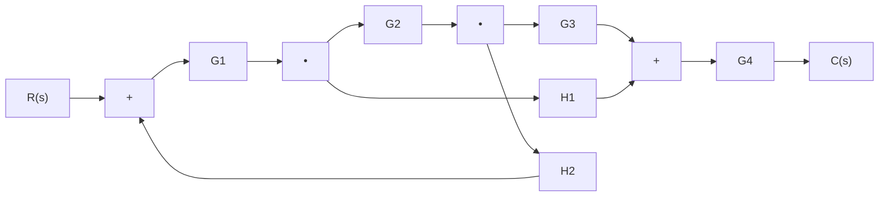

# Lazos Entrelazados

> [!definicion] Definición de Lazos Entrelazados
> Un **lazo entrelazado** es una configuración de [[Diagramas de Bloques/index|diagramas de bloques]] en la cual dos o más trayectorias de realimentación comparten segmentos de la cadena directa a través de **nodos de bifurcación comunes**, pero realimentan a **puntos de suma distintos**. A diferencia de los [[Lazos Anidados]], ningún lazo contiene completamente al otro; y a diferencia de los [[Lazos Independientes]], las trayectorias no pueden reducirse por separado.

La característica distintiva es que los lazos **se intersectan en uno o más nodos de bifurcación**, lo que impide la reducción secuencial simple.

---

## Topologías de Entrelazamiento

> [!teoria] Variante 1: Bifurcación Intermedia Compartida
> Un único nodo de bifurcación alimenta simultáneamente una realimentación y la continuación de la cadena directa.

> [!teoria] Análisis de la Variante 1
> - **Nudo N1**: Punto crítico de entrelazamiento. La señal a la salida de $G_2$ se bifurca hacia:
>   - $H_1$: Cerrando el **Lazo 1** ($S_1 \to G_1 \to S_2 \to G_2 \to N1 \to H_1 \to S_1$).
>   - $G_3$: Continuando la cadena directa y alimentando el **Lazo 2**.
> - **Lazo 2**: $S_2 \to G_2 \to N1 \to G_3 \to N2 \to H_2 \to S_2$.
>
> Los lazos comparten $G_2$ y el nodo $N1$, pero el Lazo 1 contiene a $G_1$ (no presente en Lazo 2) y el Lazo 2 contiene a $G_3$ (no presente en Lazo 1). **No hay anidamiento completo**.

---

> [!teoria] Variante 2: Entrelazamiento por Sumador Común
> Dos lazos convergen al mismo sumador pero toman señales de puntos de bifurcación distintos en la cadena directa.

> [!teoria] Análisis de la Variante 2
> - **Lazo 1**: $S_1 \to G_1 \to N1 \to H_1 \to S_1$. Envuelve solo a $G_1$.
> - **Lazo 2**: $S_1 \to G_1 \to N1 \to G_2 \to N2 \to H_2 \to S_1$. Envuelve a $G_1$ y $G_2$.
>
> Ambos lazos comparten $G_1$ y convergen en $S_1$. El Lazo 1 no está "dentro" del Lazo 2 en el sentido de anidamiento, porque la realimentación $H_1$ toma la señal **antes** de que el Lazo 2 complete su trayectoria directa. Es una configuración de **entrelazamiento por suma común**.

---

> [!teoria] Variante 3: Entrelazamiento Cruzado Simétrico
> Dos lazos se cruzan de manera simétrica, cada uno tomando señal de un punto distinto y realimentando a un sumador distinto, pero compartiendo un bloque central.

> [!teoria] Análisis de la Variante 3
> - **Lazo 1**: $S_1 \to G_1 \to N1 \to G_2 \to N2 \to G_3 \to S_2 \to G_4 \dots$ No cierra. *Corrección*: El Lazo 1 es $S_2 \to G_4 \dots$? No.
> - En realidad: **Lazo 1** ($H_1$) va de $N1$ a $S_2$. **Lazo 2** ($H_2$) va de $N2$ a $S_1$.
> - El **Lazo 1** completo: $S_1 \to G_1 \to N1 \to H_1 \to S_2 \to G_4 \dots$? Falta realimentación desde $C$ para cerrar. Esta estructura es una **realimentación cruzada de estados intermedios**, común en sistemas multivariables.

---

## Reducción de Lazos Entrelazados

> [!teorema] Fórmula de Mason para Entrelazamiento
> Debido al cruce de trayectorias, la función de transferencia se obtiene aplicando la **Fórmula de Ganancia de Mason**:
> 
> $$T(s) = \frac{\sum_k P_k \Delta_k}{\Delta}$$
> 
> Donde:
> - $P_k$: Ganancia de la $k$-ésima trayectoria directa.
> - $\Delta = 1 - \sum L_i + \sum L_i L_j - \sum L_i L_j L_k + \cdots$
> - $L_i$: Ganancia del $i$-ésimo lazo.
> - $\Delta_k$: Cofactor de la trayectoria $P_k$ (determinante de la parte del grafo que **no toca** a $P_k$).

---

> [!teoria] Aplicación a la Variante 1
> Para el diagrama de la Variante 1:
>
> **Trayectorias directas ($P_k$):**
> - $P_1 = G_1 G_2 G_3 G_4$
>
> **Lazos individuales ($L_i$):**
> - $L_1 = -G_1 G_2 H_1$
> - $L_2 = -G_2 G_3 H_2$
>
> **Interacción entre lazos:**
> - $L_1$ y $L_2$ **se tocan** (comparten $G_2$ y el nodo $N1$).
> - No hay pares de lazos no tocados → $\sum L_i L_j = 0$.
>
> **Determinante ($\Delta$):**
> $$\Delta = 1 - (L_1 + L_2) = 1 + G_1 G_2 H_1 + G_2 G_3 H_2$$
>
> **Cofactor ($\Delta_1$):**
> - $P_1$ toca todos los lazos → $\Delta_1 = 1$.
>
> **Función de Transferencia Total:**
> $$T(s) = \frac{G_1 G_2 G_3 G_4}{1 + G_1 G_2 H_1 + G_2 G_3 H_2}$$

---

> [!teoria] Aplicación a la Variante 2
> Para el diagrama de la Variante 2:
>
> **Trayectorias directas:**
> - $P_1 = G_1 G_2 G_3$
>
> **Lazos individuales:**
> - $L_1 = -G_1 H_1$
> - $L_2 = -G_1 G_2 H_2$
>
> **Interacción entre lazos:**
> - $L_1$ y $L_2$ **se tocan** (comparten $G_1$).
> - No hay pares de lazos no tocados.
>
> **Determinante ($\Delta$):**
> $$\Delta = 1 + G_1 H_1 + G_1 G_2 H_2$$
>
> **Función de Transferencia Total:**
> $$T(s) = \frac{G_1 G_2 G_3}{1 + G_1 H_1 + G_1 G_2 H_2}$$

---

> [!teoria] Método Alternativo: Movimiento de Nodos
> En algunos casos, los lazos entrelazados pueden transformarse en [[Lazos Anidados]] aplicando las reglas de [[Movimiento de Nodos]].
>
> **Procedimiento para Variante 1:**
> 1. Mover el punto de bifurcación $N1$ (que alimenta $H_1$) hacia la salida de $G_1$.
>    - Se agrega $G_2$ en la rama de $H_1$.
> 2. El sistema se convierte en una estructura anidada estándar.
> 3. Reducir secuencialmente de adentro hacia afuera.
>
> **Limitación:** Este método requiere que $G_2^{-1}$ exista y sea realizable, lo cual no siempre es cierto.

---

## Comparación con Otras Estructuras

> [!teoria] Tabla Comparativa
> | Estructura | Jerarquía | Puntos de Suma | Reducción |
> | :--- | :--- | :--- | :--- |
> | [[Lazos Anidados]] | Clara (Interno/Externo) | Jerárquicos | Secuencial (adentro → afuera) |
> | **Lazos Entrelazados** | **No existe**. Lazos comparten nodos. | Distintos o común | Mason o Movimiento de Nodos |
> | [[Lazos Independientes]] | Paralela | Independientes | Cada lazo por separado |
> | [[Lazo Simple]] | Única | Único | Fórmula estándar |

---

## Ejemplos de Aplicación

> [!ejemplo] Control en Cascada con Realimentación Auxiliar
> En un sistema de control de temperatura de un horno industrial:
> - **Lazo 1**: Control maestro de temperatura final (realimenta desde termopar de salida).
> - **Lazo 2**: Control esclavo de flujo de combustible (realimenta desde sensor de caudal).
>
> Si el sensor de caudal toma señal **después** de la válvula pero **antes** del quemador, y el termopar toma señal al final del horno, la estructura resultante es **entrelazada** (Variante 1). El bloque $G_2$ representa la válvula, compartida por ambas dinámicas.

> [!ejemplo] Sistema de Suspensión Activa
> En un vehículo con control de altura y control de aceleración vertical:
> - **Lazo 1**: Realimentación de posición de la carrocería (lento, externo).
> - **Lazo 2**: Realimentación de aceleración del amortiguador (rápido, interno).
>
> La señal del actuador hidráulico afecta ambas mediciones, pero los sensores están ubicados en puntos físicos distintos. El diagrama resultante corresponde a la **Variante 3** (entrelazamiento cruzado simétrico).

---

> [!warning] Consideraciones Prácticas
> - Los lazos entrelazados **no pueden reducirse** con las reglas básicas de [[Álgebra de Bloques]] sin un análisis previo.
> - Intentar reducir un lazo ignorando el entrelazamiento produce **funciones de transferencia incorrectas**.
> - En sistemas de control reales, el entrelazamiento suele indicar **acoplamiento dinámico** entre subsistemas que idealmente deberían diseñarse como [[Lazos Independientes]].