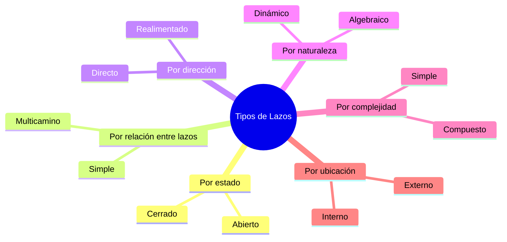

# Lazos y Estructuras

> [!definicion] Definición de Lazo
> En un [[Diagramas de Bloques/index|diagrama de bloques]], un **lazo** (o **camino cerrado**) es una trayectoria que comienza en un nodo, recorre una secuencia de bloques y retorna al mismo nodo inicial sin repetir ningún nodo intermedio.

---

## Clasificación General

### 1. Según el estado del sistema

| Tipo | Descripción | Característica |
|------|-------------|----------------|
| [[Lazo Abierto]] | No existe realimentación. La salida no influye en la entrada. | $y = G u$ |
| [[Lazo Cerrado]] | Existe realimentación. La salida se compara con la referencia. | $y = \frac{G}{1+GH} u$ |

### 2. Según la relación entre múltiples lazos

| Tipo | Descripción |
|------|-------------|
| [[Lazos Independientes]] | No comparten nodos. Se reducen por separado. |
| [[Lazos Anidados]] | Un lazo está completamente dentro de otro (jerarquía). |
| [[Lazos Cruzados]] | Comparten algunos nodos pero no hay contención total. |
| [[Lazos Entrelazados]] | Se cruzan mutuamente: la bifurcación de uno está dentro del otro, y viceversa. |
| [[Lazos Tangenciales]] | Comparten un nodo pero no comparten ramas. |

### 3. Según la dirección de la señal

| Tipo | Descripción |
|------|-------------|
| [[Lazo Directo]] | La trayectoria principal de la entrada a la salida. |
| [[Lazo de Realimentación]] | Camino que retorna señal desde la salida hacia la entrada. |
| [[Lazo de Prealimentación]] | Camino que evita parte del lazo principal (feedforward). |

### 4. Según la naturaleza de los bloques

| Tipo | Descripción |
|------|-------------|
| [[Lazo Dinámico]] | Contiene al menos un bloque con dinámica ($G(s)$ no constante). |
| [[Lazo Algebraico]] | Todos los bloques son ganancias constantes. |
| [[Lazo con Retardo]] | Contiene bloques $e^{-sT}$ (transporte puro). |
| [[Lazo Discreto]] | Operación en $z$ (muestreado). |

### 5. Según la complejidad estructural

| Tipo | Descripción |
|------|-------------|
| [[Lazo Simple]] | Un solo camino de realimentación. |
| [[Lazo Múltiple]] | Varios caminos de realimentación. |
| [[Lazo Multicamino]] | Múltiples trayectorias directas (feedforward paralelo). |
| [[Lazo MIMO]] | Múltiples entradas y salidas (matricial). |

### 6. Según el comportamiento en régimen permanente

| Tipo | Descripción |
|------|-------------|
| [[Lazo Tipo 0]] | Error estático finito ante escalón. |
| [[Lazo Tipo 1]] | Error nulo ante escalón, finito ante rampa. |
| [[Lazo Tipo 2]] | Error nulo ante escalón y rampa, finito ante parábola. |

### 7. Según la ubicación del lazo

| Tipo | Descripción |
|------|-------------|
| [[Lazo Interno]] | Lazo que no contiene otros lazos dentro. |
| [[Lazo Externo]] | Lazo que contiene otros lazos en su interior. |
| [[Lazo Principal]] | El lazo que contiene la referencia y la salida principal. |
| [[Lazo Secundario]] | Lazos auxiliares (ej. compensadores, filtros). |

---

## Mapa de Relaciones entre Tipos

---

## Teoremas Relacionados

> [!teorema] Reducción de Lazos Anidados
> Un [[Lazos Anidados|lazo dentro de otro]] puede reducirse comenzando desde el lazo más interno hacia el más externo.

> [!teorema] Fórmula de Mason
> Para cualquier configuración de [[Lazos Entrelazados|lazos entrelazados]] o [[Lazos Cruzados|cruzados]]:
> $$
> G(s) = \frac{\sum P_k \Delta_k}{\Delta}
> $$

> [!teorema] Estabilidad en Lazo Cerrado
> Un [[Lazo Cerrado]] es estable si todos los polos de $G_{lc}(s) = \frac{G}{1+GH}$ tienen parte real negativa.

> [!teorema] Error Estático y Tipo de Lazo
> El error en régimen permanente depende del número de integradores en $G(s)H(s)$, ver [[Lazo Tipo 0]], [[Lazo Tipo 1]] y [[Lazo Tipo 2]].
