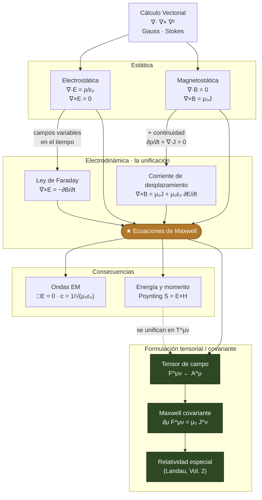

# Tree

```tree
Electromagnetismo/
│
├── 1 Calculo Vectorial/                             # el lenguaje del electromagnetismo
│   ├── index.md
│   ├── Campos y Operadores.md                       # campo escalar/vectorial; grad, div, rot, laplaciano   # fig
│   ├── Teoremas Integrales.md                        # Gauss (divergencia) y Stokes (rotacional); Green   # fig
│   ├── Identidades Vectoriales.md                    # rot(grad)=0, div(rot)=0, BAC-CAB, etc. (notación indicial)
│   └── Delta de Dirac y Singularidades.md            # delta 3D; div(r̂/r²)=4π δ³(r)
│
├── 2 Electrostatica/
│   ├── index.md
│   ├── Ley de Coulomb y Campo Electrico.md           # F=qE; E de distribución; principio de superposición   # fig
│   ├── Ley de Gauss.md                               # ∮E·dA=Q/ε₀; ∇·E=ρ/ε₀; simetrías   # fig
│   ├── Potencial Electrico.md                        # E=-∇V; V=∫ρ/(4πε₀r); circulación nula
│   ├── Poisson y Laplace.md                          # ∇²V=-ρ/ε₀; unicidad; condiciones de frontera
│   ├── Energia Electrostatica.md                     # W=½∫ε₀E² dV
│   ├── Conductores.md                                # E=0 dentro; carga superficial; problemas de frontera (imágenes)
│   └── Dielectricos/                                 # respuesta de la materia
│       ├── index.md
│       ├── Polarizacion.md                           # P, cargas ligadas ρ_b=-∇·P
│       └── Desplazamiento Electrico.md               # D=ε₀E+P; ∇·D=ρ_libre; ε
│
├── 3 Magnetostatica/
│   ├── index.md
│   ├── Fuerza de Lorentz.md                          # F=q(E+v×B); fuerza sobre corrientes   # fig
│   ├── Ley de Biot-Savart.md                         # B de una corriente   # fig
│   ├── Ley de Ampere.md                              # ∮B·dl=μ₀I; ∇×B=μ₀J; simetrías   # fig
│   ├── Potencial Vector.md                           # B=∇×A; gauge de Coulomb; ∇²A=-μ₀J
│   └── Materiales Magneticos.md                      # M, corrientes ligadas; H=B/μ₀-M; ∇×H=J_libre
│
├── 4 Electrodinamica/                                # la unificación
│   ├── index.md
│   ├── Ley de Faraday.md                             # ∇×E=-∂B/∂t; fem inducida; Lenz   # fig
│   ├── Corriente de Desplazamiento.md                # +μ₀ε₀∂E/∂t; por qué Ampère fallaba (continuidad)
│   ├── Ecuaciones de Maxwell.md                       # las 4, forma integral y diferencial; en medios
│   ├── Potenciales y Gauge.md                        # E,B desde V y A; gauge de Lorenz; invariancia
│   └── Energia y Momento.md                          # vector de Poynting S=E×H/μ₀; teorema de Poynting; tensor de esfuerzos de Maxwell
│
├── 5 Ondas Electromagneticas/
│   ├── index.md
│   ├── Ecuacion de Ondas.md                          # □E=0 desde Maxwell en el vacío; c=1/√(μ₀ε₀)
│   ├── Ondas Planas.md                               # E,B,k ortogonales; E=cB; impedancia   # fig
│   ├── Polarizacion.md                               # lineal, circular, elíptica   # fig
│   └── Ondas en Medios.md                            # índice n; reflexión y refracción (Fresnel); conductores
│
└── 6 Formulacion Covariante/                         # el pico tensorial — enfoque del usuario
    ├── index.md
    ├── Cuadrivectores.md                             # x^μ, métrica η_μν, J^μ=(cρ,J); invariantes   # fig
    ├── Tensor de Campo.md                            # F^μν a partir de A^μ=(V/c,A); E y B como componentes
    ├── Maxwell Covariante.md                         # ∂_μ F^μν=μ₀J^ν y ∂_μ(*F)^μν=0: las 4 en 2 ecuaciones
    └── Tensor Energia-Momento.md                     # T^μν del campo; energía/momento/Poynting unificados
```

---

# Marco conceptual (mapa de ideas)



> **Idea rectora:** dos estáticas independientes (E y B) se **acoplan** en cuanto los campos varían en
> el tiempo —Faraday liga $\nabla\times E$ a $\partial_t B$, y la corriente de desplazamiento (exigida por
> la conservación de la carga) liga $\nabla\times B$ a $\partial_t E$—. Ese acoplamiento **son las
> ecuaciones de Maxwell**, de las que salen las **ondas** (la luz) y, al escribirlas en lenguaje
> **tensorial** ($F^{\mu\nu}$), su forma relativista: cuatro ecuaciones vectoriales colapsan en dos
> tensoriales. Ese es el viaje del curso: **vectorial → unificación → tensorial**.
