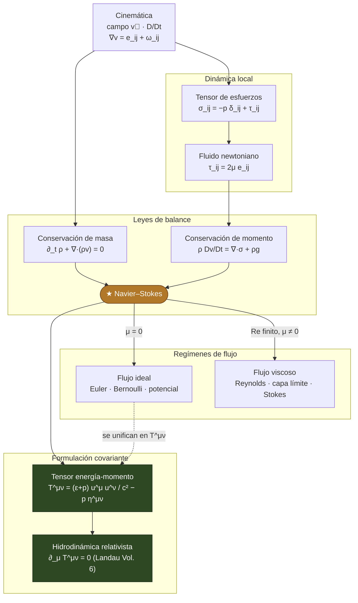

# Tree

```tree
Mecanica de Fluidos/
│
├── 1 Cinematica del Flujo/                          # describir el movimiento del fluido
│   ├── index.md
│   ├── Descripcion Euleriana y Lagrangiana.md       # derivada material D/Dt = ∂_t + (v·∇)
│   ├── Lineas de Flujo.md                            # líneas de corriente, trayectoria, traza   # fig
│   ├── Tensor Gradiente de Velocidad.md              # ∂_j v_i = e_ij + ω_ij (simétrico + antisimétrico)   # fig
│   ├── Deformacion y Vorticidad.md                   # tensor de rapidez de deformación e_ij; vorticidad ω=∇×v   # fig
│   └── Teorema del Transporte de Reynolds.md         # d/dt ∫_V φ dV = ∫ [∂_t φ + ∇·(φv)] dV
│
├── 2 Esfuerzos y Tensor de Tensiones/                # el corazón tensorial
│   ├── index.md
│   ├── Tensor de Esfuerzos de Cauchy.md              # t_i = σ_ij n_j; simetría σ_ij = σ_ji   # fig
│   ├── Presion y Esfuerzos Viscosos.md               # σ_ij = -p δ_ij + τ_ij
│   └── Fluido Newtoniano.md                          # τ_ij = 2μ e_ij + λ δ_ij e_kk (relación constitutiva)
│
├── 3 Ecuaciones de Conservacion/                     # las leyes de balance
│   ├── index.md
│   ├── Conservacion de Masa.md                       # continuidad ∂_t ρ + ∇·(ρv) = 0
│   ├── Conservacion de Momento.md                    # Cauchy: ρ Dv/Dt = ∇·σ + ρg
│   ├── Ecuaciones de Navier-Stokes.md                # ρ Dv/Dt = -∇p + μ∇²v + ρg   # la ecuación maestra
│   └── Conservacion de Energia.md                    # 1ª ley; disipación viscosa Φ
│
├── 4 Flujo Ideal/                                    # μ = 0: lo que se resuelve a mano
│   ├── index.md
│   ├── Ecuacion de Euler.md                          # ρ Dv/Dt = -∇p + ρg
│   ├── Ecuacion de Bernoulli.md                      # ½v² + p/ρ + gz = cte (a lo largo de una línea)   # fig
│   ├── Flujo Potencial.md                            # ∇×v=0 ⇒ v=∇φ, ∇²φ=0; flujo alrededor de un cilindro   # fig
│   └── Vorticidad y Teoremas.md                      # ecuación de vorticidad; teoremas de Kelvin y Helmholtz
│
├── 5 Flujo Viscoso/                                  # μ ≠ 0: el número de Reynolds manda
│   ├── index.md
│   ├── Numero de Reynolds y Adimensionalizacion.md   # Re = ρUL/μ; semejanza dinámica   # fig
│   ├── Soluciones Viscosas Exactas.md                # Couette y Poiseuille (perfiles)   # fig
│   ├── Capa Limite.md                                # Prandtl; espesor δ ~ √(νx/U)   # fig
│   └── Flujo de Stokes.md                            # Re ≪ 1; arrastre de Stokes F = 6πμRU
│
└── 6 Formulacion Covariante del Fluido/              # el pico tensorial — enfoque del usuario
    ├── index.md
    ├── Flujo Compresible y Ondas de Choque.md        # número de Mach; velocidad del sonido; Rankine-Hugoniot   # fig
    ├── Tensor Energia-Momento del Fluido.md          # T^μν = (ε+p) u^μ u^ν / c² - p η^μν (fluido perfecto)   # fig
    └── Hidrodinamica Relativista.md                  # ∂_μ T^μν = 0 ⇒ continuidad + Euler relativista (Landau Vol. 6)
```

---

# Marco conceptual (mapa de ideas)



> **Idea rectora:** la **cinemática** describe el campo de velocidades y descompone su gradiente en
> **deformación** ($e_{ij}$) y **vorticidad** ($\omega_{ij}$). La dinámica local introduce el **tensor de
> esfuerzos** $\sigma_{ij}$ y, para un **fluido newtoniano**, lo liga a la deformación. Metidos en las
> **leyes de balance** (masa y momento) producen las **ecuaciones de Navier–Stokes** —la ecuación maestra
> del curso, el análogo de Maxwell—. De ellas salen los dos **regímenes**: el **ideal** ($\mu=0$: Euler,
> Bernoulli, flujo potencial) y el **viscoso** (número de Reynolds, capa límite, Stokes). Y al escribir la
> conservación en lenguaje **tensorial** —el tensor energía-momento $T^{\mu\nu}$ del fluido— se llega a la
> **hidrodinámica relativista** ($\partial_\mu T^{\mu\nu}=0$), el puente a **Landau Vol. 6**. El viaje del
> curso: **vectorial → Navier–Stokes → tensorial**.
